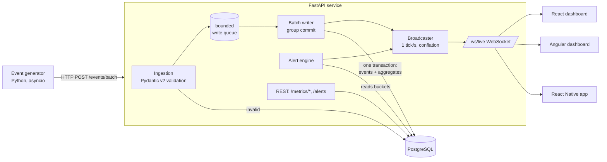

# PLAN — realtime-analytics-dashboard

A real-time analytics pipeline for e-commerce order events (amounts in MAD, Moroccan cities),
from synthetic event generation to live dashboards on **three clients**: React (web),
Angular (web) and React Native (mobile).

This file is the working plan. Architecture reasoning lives in [docs/DECISIONS.md](docs/DECISIONS.md).

> **Status (2026-09-15): all milestones M0–M11 are done** and published, with CI passing. Additions
> beyond the plan: a history backfill in the generator, an alert-rule backtest that replaced the first
> thresholds, an order-count traffic rule, a data retention job, and ingest profiling. The React Native
> app has been verified on a real phone with Expo Go.

---

## 1. Architecture



### Data flow in one sentence
The generator POSTs batches → the API validates each event (bad ones go to `dead_letter_events`,
the request never crashes) → valid events join a bounded in-memory queue → a single writer task
drains the queue and, **in one SQL round-trip**, inserts the raw events *and* incrementally upserts
the time-bucketed aggregate tables → once per second the broadcaster reads the small aggregate
tables, evaluates alert rules, and pushes a conflated update to every connected WebSocket client.

### Key design choices (details in docs/DECISIONS.md)
| Topic | Choice |
|---|---|
| DB access | `asyncpg` directly (fast bulk inserts, no ORM overhead on the hot path) |
| Schema changes | Plain numbered SQL migrations applied at API startup |
| Aggregation | Per-minute bucket tables maintained incrementally with `INSERT … ON CONFLICT DO UPDATE` inside a writable CTE that only counts rows actually inserted (so duplicates are never double-counted) |
| Write path | Bounded queue + single batch writer (“group commit”). The HTTP request awaits its batch's commit, so `202` means “durably stored” |
| Backpressure | Queue full → `429 Too Many Requests` + `Retry-After`; generator backs off |
| Live push | WebSocket, server ticks at 1 Hz; per-client queue of size 1 (latest state wins) so slow clients never slow down fast ones |
| Alerts | Rules evaluated on the aggregate tables each tick, with a firing/resolved state machine + cooldown to avoid flapping |
| Clients | Shared TS package (`@rad/core`): message types, reconnecting WS client (exponential backoff + jitter), state reducer |
| Fan-out scope | Single API process (documented limitation; Postgres `LISTEN/NOTIFY` is the planned multi-instance step — no Redis) |

---

## 2. Folder structure

```
realtime-analytics-dashboard/
├── PLAN.md
├── README.md
├── docker-compose.yml
├── .github/workflows/ci.yml
├── docs/
│   ├── DECISIONS.md
│   └── images/                     # screenshots / GIF for README
├── backend/                        # one uv project: api + generator + bench share models
│   ├── pyproject.toml
│   ├── uv.lock
│   ├── Dockerfile
│   ├── src/rad/
│   │   ├── common/                 # config, logging, event schema (Pydantic)
│   │   ├── api/                    # FastAPI app, routes, ws, broadcaster
│   │   ├── db/                     # pool, migrations runner, sql/*.sql
│   │   ├── processing/             # batch writer, aggregate queries, snapshots
│   │   ├── alerts/                 # rule definitions + engine (pure functions)
│   │   └── generator/              # synthetic order-lifecycle simulator
│   ├── bench/                      # load + end-to-end latency benchmark
│   └── tests/                      # pytest (unit + DB integration + WS integration)
└── frontends/                      # npm workspaces
    ├── package.json
    ├── packages/core/              # @rad/core — shared TS (types, ws client, reducer) + vitest
    ├── web-react/                  # Vite + React + TS + Recharts + React Query
    ├── web-angular/                # Angular (standalone components + signals)
    └── mobile-react-native/        # Expo + React Native + TS
```

---

## 3. Event model

One event = one order lifecycle transition. Orders move `placed → paid → shipped`, or get
`cancelled` (from `placed` or `paid`).

| Field | Type | Notes |
|---|---|---|
| `event_id` | UUID | idempotency key (duplicates ignored) |
| `order_id` | UUID | groups the lifecycle |
| `event_type` | `order_placed` \| `order_paid` \| `order_shipped` \| `order_cancelled` | |
| `occurred_at` | timestamptz | event time (when it happened at the source); buckets use this |
| `amount_mad` | decimal(12,2) | > 0, ≤ 1,000,000 |
| `category` | enum (electronics, fashion, home, beauty, grocery, sports, books, toys) | |
| `city` | enum (Casablanca, Rabat, Marrakech, Fes, Tangier, Agadir, Meknes, Oujda, Kenitra, Tetouan) | |
| `payment_method` | `card` \| `cash_on_delivery` \| `wallet` \| `bank_transfer` | |

Metric definitions (written down so every client computes nothing on its own):
- **Revenue** = sum of `amount_mad` over `order_paid` events in the window.
- **Orders** = count of `order_placed`.
- **Average order value (AOV)** = revenue / number of `order_paid`.
- **Cancellation rate** = `order_cancelled` / `order_placed` in the window.
- **Orders per status** = current status of every order seen in the last 24h.

---

## 4. Milestones (in order)

Each milestone ends with: tests green → small honest commit → README/DECISIONS updated.

### M0 — Repo skeleton
- `git init`, `.gitignore`, `.gitattributes` (force LF so shell scripts work in Linux containers), PLAN.md, README stub, DECISIONS.md stub.
- `docker-compose.yml` with Postgres only; `backend/` uv project with ruff + mypy + pytest configured.
- **Done when:** `docker compose up postgres` is healthy, `uv run pytest` runs (even with a trivial test), first commit exists.

### M1 — Ingestion API
- Pydantic v2 event schema with strict validation (enums, positive amount, timezone-aware timestamps, not too far in the future).
- `POST /events` and `POST /events/batch`: per-event validation, invalid events + malformed JSON stored in `dead_letter_events` with the raw payload and the error; response reports accepted/rejected counts.
- Migrations runner, `events` table with indexes, bounded queue + batch writer, `429` on overload.
- `GET /health`.
- **Done when:** pytest covers valid, invalid, malformed, duplicate and oversized payloads; a crafted garbage request never produces a 500; events land in Postgres.

### M2 — Processing layer (incremental aggregates)
- Tables: `agg_minute` (counts per type + revenue), `agg_minute_category`, `agg_minute_city`, `agg_minute_payment`, `orders` (current status).
- The writer's single CTE statement: insert events `ON CONFLICT DO NOTHING RETURNING` → upsert aggregates from only the returned rows.
- Snapshot queries: revenue per minute (last 60 min), revenue per hour (last 24 h, rolled up from minute buckets), orders per status, top categories, top cities, AOV, cancellation rate.
- `GET /metrics/snapshot`, `GET /metrics/timeseries?granularity=minute|hour`.
- **Done when:** tests prove aggregates equal a brute-force recomputation from raw events (including duplicates and late events), and `EXPLAIN` shows snapshot queries hit bucket indexes, not the raw table.

### M3 — Event generator
- Async simulator of order lifecycles (pending transitions in a time-ordered heap).
- Configurable base events/sec, daily curve (Casablanca local time, optional time compression for demos), random flash-sale bursts, anomalies (payment-outage → cancellation spike, city-specific surge), a configurable fraction of malformed events.
- Batches over HTTP with retry + backoff on `429`/network errors.
- **Done when:** `docker compose up` shows events flowing into Postgres; generator unit tests cover lifecycle validity and rate shaping.

### M4 — WebSocket layer
- `/ws/live`: sends a full `snapshot` on connect, then `update` messages at 1 Hz, `events` (recent feed sample), `alert`, and heartbeats.
- Connection manager: per-client bounded queue with conflation, slow-client eviction, clean handling of disconnects.
- **Done when:** integration test connects several clients, ingests events, and asserts every client receives an update reflecting them; a stalled client does not delay the others.

### M5 — Alerting
- Rules (thresholds via env):
  - cancellation rate over last 5 min > X % (with a minimum order volume),
  - revenue over last 5 min dropped > Y % vs previous 5 min (with a minimum baseline),
  - dead-letter ratio over last 5 min > Z %,
  - no events ingested for N seconds (pipeline stalled).
- Pure-function evaluation + state machine (`ok → firing → resolved`, cooldown), persisted in `alerts` table, pushed over WS, `GET /alerts`.
- **Done when:** pytest covers each rule's boundaries and anti-flapping; the generator's anomaly mode visibly triggers an alert in the UI.

### M6 — Shared client core (`@rad/core`)
- TypeScript message types mirroring the backend schemas.
- `LiveConnection`: WebSocket wrapper with exponential backoff + full jitter, status events (`connecting | open | reconnecting | offline`), heartbeat timeout detection.
- Pure reducer that merges `snapshot`/`update` messages into a client-side state.
- **Done when:** vitest covers backoff schedule, reconnection and reducer merging.

### M7 — React dashboard (`frontends/web-react`)
- KPI cards, revenue time-series (Recharts, animation off for live data, memoized series), category breakdown, live event feed (capped list), connection indicator, alert toasts/panel.
- React Query for the REST history (initial timeseries, alerts), WebSocket for live deltas.
- **Done when:** runs in compose, `tsc` + eslint + vitest pass, charts update without flicker (verified with React Profiler: only changed components re-render).

### M8 — Angular dashboard (`frontends/web-angular`)
- Same features with standalone components, signals, and a charting lib that works well with Angular (ECharts via `ngx-echarts`, or Chart.js — chosen at implementation, reason recorded).
- **Done when:** runs in compose, `ng build` + lint + unit tests pass.

### M9 — React Native app (`frontends/mobile-react-native`)
- Expo + TS: KPI cards, revenue sparkline, category bars, alert banner, connection status; reuses `@rad/core`.
- Not part of `docker compose` (a phone app doesn't run in a container); runs with `npx expo start` + Expo Go, API URL via `EXPO_PUBLIC_API_URL`.
- **Done when:** `tsc` passes, the app connects to the local API from Expo Go (or Expo web as fallback) and shows live data.

### M10 — CI
- GitHub Actions on every push: backend (ruff, mypy, pytest against a Postgres service container), frontends (install, typecheck, lint, test, build for each app).
- **Done when:** workflow file validated locally (as far as possible) and green after the first push.

### M11 — Benchmark, screenshots, final README
- `backend/bench/`: sustained ingest throughput (events/sec accepted at steady state, error rate) and end-to-end latency (event creation → update received by a WebSocket client; p50/p95/p99).
- Real measured numbers + machine description in README. Screenshots/GIF of the dashboards.
- README: problem statement, Mermaid architecture, quick start, screenshots, measured performance, alert rules, tests & CI badge, limitations, next steps.
- **Done when:** every number in the README comes from a benchmark run recorded in `bench/results/`.

---

## 5. Ground rules
- No Kafka, Redis, cloud services or heavy installs without asking first.
- Ask before the first push to GitHub and before deleting files.
- Never invent numbers: README performance figures come only from real benchmark runs.
- Screenshots may need a headless browser (Playwright + Chromium ≈ a few hundred MB) — will ask before installing.

## 6. Local environment notes
- WSL2 Ubuntu has Docker (Desktop integration), uv, Python 3.14, git. Node is available on the Windows side (v24).
- No local `psql` needed: use `docker compose exec postgres psql`.
- Ports: Postgres 5432, API 8000, React 5173, Angular 4200 (adjusted if already taken).
