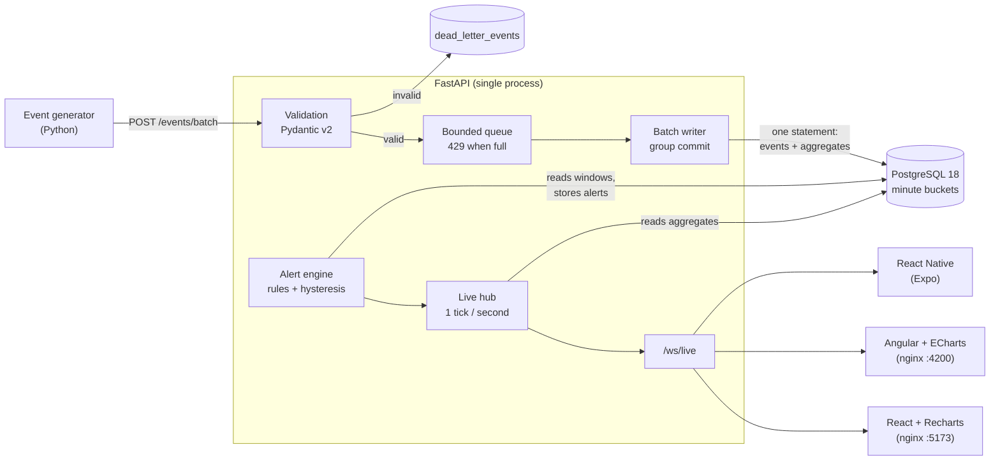

# realtime-analytics-dashboard

A real-time analytics pipeline for e-commerce order events (amounts in MAD, Moroccan cities),
from synthetic event generation to live dashboards in **React**, **Angular** and **React Native**.

<!-- CI badge: added after the repository is published on GitHub. -->

## Problem

An online shop wants to watch its business **as it happens**: revenue in the last hour, orders per
status, which categories and cities are selling, and an immediate warning when something goes
wrong, such as a payment provider failing (cancellations spike) or traffic collapsing (revenue drops).

That requires more than a chart on top of a database table:
- ingest thousands of events per second without losing any, and without crashing on bad data;
- compute rolling metrics **without re-scanning** all historical events on every refresh;
- push updates to many open dashboards at once, including slow mobile clients, without polling;
- detect anomalies without flooding people with flapping alerts.

## What it does

- **Event generator:** a realistic synthetic stream of order lifecycles (placed → paid → shipped
  or cancelled) with a daily traffic curve, flash-sale bursts, injected anomalies (payment outage,
  traffic drop) and ~1% deliberately malformed events.
- **Ingestion API (FastAPI + Pydantic v2):** validates each event on its own. Bad input goes to a
  dead-letter table instead of crashing anything. A group-commit writer batches concurrent
  requests into single transactions, and a bounded queue answers `429` under overload.
- **Processing (PostgreSQL 18):** per-minute aggregate tables are updated **in the same SQL
  statement** that inserts the events, counting only rows actually inserted (retries never double
  count). Dashboards read only these small tables.
- **Live push (WebSocket):** one snapshot per second, built once and fanned out to every client.
  Slow clients get conflated state and are evicted if stuck, so they never slow down others.
- **Alerting:** four threshold rules, time-based hysteresis against flapping, stored and pushed live.
- **Three clients** sharing one TypeScript core (`@rad/core`): reconnection with backoff, message
  types, and a state reducer that lets unchanged UI sections skip re-rendering.

## Architecture



The reasoning behind every choice (time-bucketed aggregates vs live queries, WebSockets vs
polling, backpressure, indexes, what went wrong) is written up in plain language in
**[docs/DECISIONS.md](docs/DECISIONS.md)**.

## Quick start

Requirements: Docker with Compose.

```bash
docker compose up --build
```

| What | URL |
|---|---|
| React dashboard | http://localhost:5173 |
| Angular dashboard | http://localhost:4200 |
| API docs (OpenAPI) | http://localhost:8000/docs |
| Live snapshot (REST) | http://localhost:8000/metrics/snapshot |

The generator is tuned with environment variables (see [.env.example](.env.example)), for example
`GEN_EVENTS_PER_SECOND=100 GEN_TIME_COMPRESSION=1440 docker compose up` squeezes a simulated day
into one real minute. The mobile app runs outside Docker with Expo Go; see
[frontends/mobile-react-native](frontends/mobile-react-native/README.md).

## Screenshots

<!-- Pending: captured from the running stack. -->

## Performance (measured)

Measured with the benchmark in [`backend/src/rad/bench`](backend/src/rad/bench/benchmark.py), run
inside the compose network against the full stack. The generator was stopped during the run.
Raw result: [`backend/bench/results/2026-09-14_1429_8x500_rate500.json`](backend/bench/results/2026-09-14_1429_8x500_rate500.json).

| Metric | Result |
|---|---|
| **Sustained ingestion** (8 concurrent senders, 500-event batches, 60 s after 10 s warm-up) | **15,408 events/s** committed (924,500 events), 0 errors, 0 × `429` |
| HTTP acknowledgement latency at max load (batch of 500, includes commit) | p50 220 ms · p95 528 ms · p99 724 ms |
| **End-to-end latency** at 500 events/s offered (event created → dashboard update received over WebSocket) | **p50 563 ms · p95 1,055 ms · p99 1,451 ms** · max 1,750 ms |
| Batches that never reached a dashboard update | 0 of 600 |

Machine: laptop with Intel Core i7-13620H (10 cores / 16 threads), 16 GB RAM, NVMe SSD, Windows 11,
Docker Desktop 29.6 (WSL2 VM limited to 8 CPUs / 10.7 GB). PostgreSQL, the API and the benchmark
client all ran on this one machine.

How to read these numbers:
- End-to-end latency is dominated by the **1-second push tick**: an event waits on average about
  half a second for the next dashboard update. The p50 of 563 ms is consistent with that.
- The end-to-end measurement is a slight **upper bound**: a batch counts as delivered with the first
  update generated after the API *acknowledged* it, and the acknowledgement comes just after the commit.
- During the latency phase the acknowledgement p99 was 1,122 ms even at only 500 events/s. This
  was not investigated. A plausible cause is PostgreSQL background work after the previous phase
  inserted ~925k rows, but it has not been verified.
- A single run on a laptop, not a controlled lab. Treat the numbers as an order of magnitude.

Reproduce:

```bash
docker compose up -d --build
docker compose stop generator
docker compose run --rm --no-deps -T generator python -m rad.bench > result.json
docker compose start generator
```

## Alerting rules

Evaluated every second on 3-minute windows read from the aggregate tables.

| Rule | Fires when (default) | Guard against noise | Severity |
|---|---|---|---|
| `cancellation_rate` | cancellations ÷ orders placed > **15%** | ≥ 30 orders in the window | warning |
| `revenue_drop` | revenue per minute more than **50%** below the previous window | previous window ≥ 5,000 MAD/min | critical |
| `dead_letter_ratio` | rejected ÷ received events > **5%** | ≥ 100 events in the window | warning |
| `pipeline_stalled` | no event stored for **30 s** | — | critical |

An alert fires only after its rule has been breached **continuously for 10 s**, and resolves only after
**30 s** of health, so values hovering around a threshold do not flap. Every threshold is configurable
(`RAD_ALERT_*`). The generator's anomalies (payment outage, traffic drop) are designed to trigger
the first two rules.

## Tests and CI

| Part | Tooling | Tests |
|---|---|---|
| Backend | pytest (real PostgreSQL + real uvicorn server), ruff, mypy `--strict` | 102 |
| `@rad/core` | vitest | 27 |
| React app | vitest + Testing Library, ESLint | 4 |
| Angular app | Angular unit-test builder (vitest), angular-eslint | 3 |
| React Native app | vitest, `tsc`, Metro web export | 4 |

Highlights:
- ingestion never answers 500 to garbage input: malformed JSON, binary data with NUL bytes, JSON
  nested 100,000 levels deep, `NaN`, oversized bodies, a full queue;
- aggregates are compared with a **brute-force recomputation** from raw events after shuffled,
  overlapping, duplicated batches;
- `EXPLAIN` proves no dashboard query reads the raw events table;
- WebSocket integration tests with several real clients, slow-client eviction, disconnects, capacity;
- alert rule boundaries and the anti-flapping state machine; end-to-end alert fire → resolve;
- reconnection backoff with fake timers; a render-count test proving unchanged React sections do
  not re-render on a live update.

GitHub Actions ([.github/workflows/ci.yml](.github/workflows/ci.yml)) runs on every push: backend
(ruff, mypy, pytest against a PostgreSQL service), all frontends (typecheck, lint, test, build,
Metro bundle), and a `docker compose build`.

Run locally:

```bash
docker compose up -d postgres
cd backend && uv sync && uv run ruff check . && uv run mypy && uv run pytest

cd frontends && npm install && npm run build:core
npm run typecheck && npm run lint && npm run test && npm run build
```

## Project structure

```
backend/                 Python (uv): API, processing, alerts, generator, benchmark, tests
  src/rad/api/           FastAPI app, ingestion + metrics + alerts routes, WebSocket hub
  src/rad/processing/    group-commit writer (events + aggregates in one statement), snapshots
  src/rad/alerts/        pure rules, anti-flapping engine, persistence
  src/rad/generator/     synthetic order-stream simulator and HTTP runner
  src/rad/db/migrations/ plain SQL migrations
frontends/               npm workspaces
  packages/core/         @rad/core: types, reconnecting WebSocket, reducer, shared styles
  web-react/             React + Vite + Recharts + React Query
  web-angular/           Angular 22 + signals + ECharts
  mobile-react-native/   Expo (React Native)
docs/DECISIONS.md        design decisions and problems met, explained without code
PLAN.md                  milestones and their definition of done
```

## Limitations

- **One API process.** The WebSocket hub keeps its clients in memory; several API instances would
  not share the live feed. (Metrics stay correct, since they come from the shared database.)
- **No retention.** Raw events and minute buckets grow forever; there is no partitioning or pruning.
- "Orders by status" counts **all orders ever seen**, not a rolling window.
- **Static alert thresholds**, blind to seasonality; alert evaluation stops if the database is down.
- **No authentication or TLS** on the API or WebSocket.
- End-to-end latency cannot go below the **1-second push tick** by design.
- The benchmark ran on one laptop, client and server sharing CPUs, one run.
- The React Native app is verified by type checking, unit tests and a Metro bundle, **not yet on a
  physical device**.

## Next steps

- PostgreSQL `LISTEN/NOTIFY` so several API instances can fan out every commit (no Redis needed).
- Partition `events` by day with a retention job; try `COPY` for higher ingest throughput.
- Profile the ingest path under load (and the acknowledgement p99 outlier) before tuning.
- Rolling 24-hour status counts; seasonality-aware alert baselines (same hour last week).
- Authentication for producers and dashboards; TLS termination at nginx.
- Browser end-to-end tests (Playwright) and an EAS build of the mobile app.
